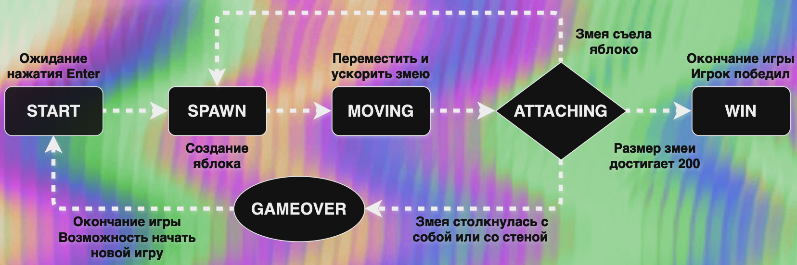

# BrickGame_v2.0
Реализованы игры «Змейка» и "Тетрис" на языке программирования С++ в парадигме объектно-ориентированного программирования.

В проекте был использовн паттерн MVC:

## Task

Реализуй BrickGame v2.0:

- Программа должна быть разработана на языке C++ стандарта C++17.
- Программа должна состоять из двух частей: библиотеки, реализующей логику игры змейка, и десктопного интерфейса.
- Для формализации логики игры должен быть использован конечный автомат.
- При написании кода придерживайся Google Style.
- Классы должны быть реализованы внутри пространства имен `s21`.
- Библиотека, реализующая логику игры, должна быть покрыта unit-тестам. Особое внимание удели проверке состояний и переходами КА. Для тестов используй библиотеку GTest. Покрытие библиотеки тестами должно составлять не меньше 80 процентов.
- Сборка программы должна быть настроена с помощью Makefile со стандартным набором целей для GNU-программ: all, install, uninstall, clean, dvi, dist, tests. Установка должна вестись в любой другой произвольный каталог.
- Реализация должна быть с графическим пользовательским интерфейсом, на базе одной из GUI-библиотеки с API для C++17:
  - Qt
- Программа должна быть реализована с использованием паттерна MVC, а также:
  - не должно быть кода бизнес-логики в коде представлений;
  - не должно быть кода интерфейса в контроллере и в модели;
  - контроллеры должны быть тонкими.
- Консольный интерфейс должен поддерживать змейку.
- В игре змейка должны присутствовать следующие механики:
  - Змейка должна передвигаться по полю самостоятельно, на один блок вперед по истечении игрового таймера.
  - Когда змейка сталкивается с «яблоком», ее длина увеличивается на один.
  - Когда длина змейки достигает 200 единиц, игра заканчивается победой игрока.
  - Когда змейка сталкивается с границей поля или сама с собой, игра заканчивается поражением игрока.
  - Пользователь может менять направление движение змейки с помощью стрелок, при этом змейка может поворачивать только налево и направо относительно текущего направления движения.
  - Пользователь может ускорять движение змейки зажатием клавиши действие.
- Начальная длина змейки равна четырем «пикселям».
- Игровое поле имеет размер 10 «пикселей» в ширину и 20 «пикселей» в высоту.
- Добавь в игру подсчет очков и механику уровней;
- хранение максимального количества очков.

## Instruction

1. To install:
	- type 'make install'
	- specify a directory to install (if not specified than installation will start to ./tetris directory)
2. To uninstall:
	- type 'make uninstall'
